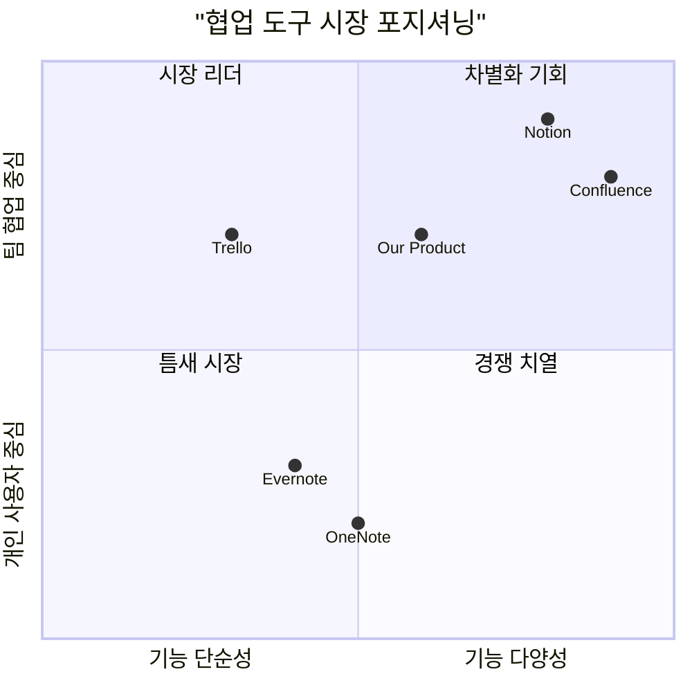
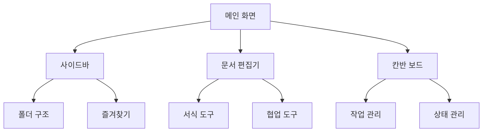

# 노션 클론 프로젝트 PRD (Product Requirements Document)

## 1. 개요

### 1.1 프로젝트 정보
- 프로젝트명: notion_clone
- 개발 기간: 총 28-36주
- 개발 언어: 
  - Frontend: JavaScript/React
  - Backend: Java/Spring Framework

### 1.2 프로젝트 목표
1. 사용자 친화적인 문서 관리 시스템 구축
2. 실시간 협업 기능을 통한 팀 생산성 향상
3. 직관적인 드래그 앤 드롭 기반의 사용자 경험 제공

### 1.3 사용자 스토리
1. "사용자로서, 소셜 로그인으로 빠르게 서비스에 접근하고 싶습니다."
2. "팀 리더로서, 팀원들과 실시간으로 문서를 공유하고 협업하고 싶습니다."
3. "프로젝트 매니저로서, 칸반 보드를 통해 업무 진행 상황을 효율적으로 관리하고 싶습니다."
4. "콘텐츠 작성자로서, 직관적인 에디터로 문서를 쉽게 작성하고 편집하고 싶습니다."

### 1.4 경쟁사 분석

#### 주요 경쟁 제품
1. Notion
   - 장점: 뛰어난 사용자 경험, 다양한 템플릿, 강력한 협업 기능
   - 단점: 높은 학습 곡선, 오프라인 지원 제한적

2. Evernote
   - 장점: 안정적인 노트 작성, 크로스 플랫폼 지원
   - 단점: 협업 기능 제한적, 현대적 인터페이스 부족

3. Trello
   - 장점: 직관적인 칸반 보드, 사용하기 쉬운 인터페이스
   - 단점: 문서 작성 기능 제한적, 복잡한 프로젝트 관리 어려움

4. Confluence
   - 장점: 강력한 문서화 기능, 기업용 기능 다수
   - 단점: 높은 가격, 복잡한 설정

5. Microsoft OneNote
   - 장점: MS Office 통합, 무료 사용 가능
   - 단점: 협업 기능 부족, 현대적 기능 부족

#### 경쟁 제품 포지셔닝

## 2. 기술 요구사항

### 2.1 기술 스택
- Frontend:
  - Vite + React
  - shadcn/ui (UI 컴포넌트)
  - react-beautiful-dnd (드래그 앤 드롭)
  - Rich Text Editor 라이브러리

- Backend:
  - Spring Framework
  - Spring Security
  - Spring Data JPA
  - PostgreSQL
  - WebSocket

- 개발 도구:
  - Git
  - Docker
  - JWT

### 2.2 요구사항 풀

#### P0 (Must Have)
1. 사용자 인증
   - 이메일/비밀번호 회원가입 및 로그인
   - Google OAuth 소셜 로그인
   - JWT 기반 인증

2. 문서 관리
   - 기본 CRUD 기능
   - 폴더/문서 구조화
   - 드래그 앤 드롭 정렬

3. 기본 에디터
   - 텍스트 포맷팅
   - 목록 생성
   - 실시간 저장

#### P1 (Should Have)
1. 협업 기능
   - 실시간 동시 편집
   - 문서 공유
   - 권한 관리

2. 칸반 보드
   - 작업 상태 관리
   - 드래그 앤 드롭 카드 이동
   - 작업 할당

3. 댓글/피드백
   - 문서 내 댓글
   - 멘션 기능
   - 알림

#### P2 (Nice to Have)
1. 템플릿
   - 미리 정의된 템플릿
   - 커스텀 템플릿 저장

2. 고급 검색
   - 전문 검색
   - 필터 및 정렬

3. 데이터 관리
   - 가져오기/내보내기
   - 버전 관리

### 2.3 UI 설계 초안

#### 주요 화면 구성
1. 네비게이션
   - 왼쪽 사이드바: 폴더/문서 트리 구조
   - 상단바: 검색, 알림, 프로필

2. 문서 편집
   - 서식 도구바
   - 실시간 협업 상태
   - 댓글/피드백 사이드패널

3. 칸반 보드
   - 상태별 컬럼
   - 드래그 앤 드롭 카드
   - 필터/정렬 옵션

## 3. 개발 로드맵

### Phase 1: MVP (4-6주)
- 기본 인증 시스템
- 문서 CRUD
- 기본 에디터
- 폴더 구조

### Phase 2: 핵심 기능 (6-8주)
- 드래그 앤 드롭
- 칸반 보드
- UI/UX 개선

### Phase 3: 협업 기능 (8-10주)
- 실시간 협업
- 공유 및 권한
- 댓글 시스템

### Phase 4: 고급 기능 (10-12주)
- 템플릿 시스템
- 검색 기능
- 데이터 관리

## 4. 오픈 질문

1. 기술적 고려사항
   - 실시간 동시 편집 시 충돌 해결 전략은?
   - 대규모 문서 처리 시 성능 최적화 방안은?

2. 사업적 고려사항
   - 무료/유료 기능 구분 기준은?
   - 시장 진입 전략은?

3. UX 관련
   - 학습 곡선 최소화 방안은?
   - 모바일 대응 전략은?

## 5. 성공 지표

1. 사용자 지표
   - 월간 활성 사용자(MAU)
   - 사용자 유지율
   - 문서 생성 수

2. 성능 지표
   - 페이지 로드 시간
   - 동시 편집 응답 시간
   - 서버 가용성

3. 비즈니스 지표
   - 유료 전환율
   - 사용자 피드백 점수
   - 팀 협업 지표